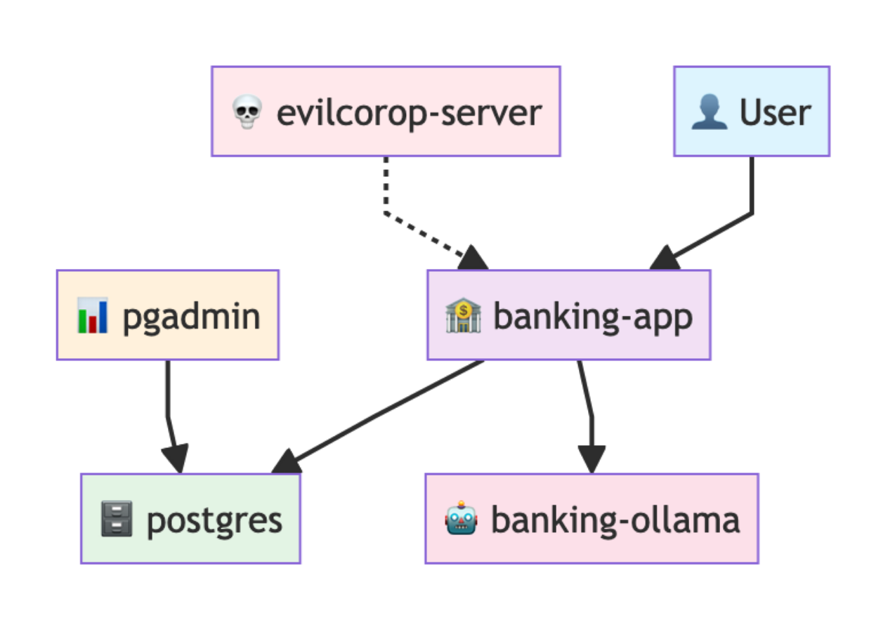

# Injection Vulnerabilities Training Application

A simulated banking application designed for security training purposes. This application provides a realistic banking interface with user accounts, transactions, and search functionality to help train users on banking security concepts.

### [Have ideas, need help? Join our Discord](https://discord.gg/UNBD8A2v9K)

## **IMPORTANT SECURITY NOTICE**

**THIS IS A TRAINING APPLICATION ONLY**
- Do NOT use in production environments
- Contains intentional security vulnerabilities for educational purposes
- All data is simulated and for training use only
- Always run in isolated/controlled environments


## Where are the exploits?

You can find a lot of exploits in `knowledge/workshop_exploits` folder. 
But there are more vulnerabilities in the app, you are free to experiment.

## Are there some materials or slides?

You can find the presentatioon in the `knowledge/slides` folder.

## The architecture

The system consists of five servers
- banking application server `banking-app`
- database server `postgres`
- pgadmin server `pgadmin`
- LLM server `banking-ollama`
- Evil server to host the attacker listeners and netcat `evilcorp-server`



## Quick Start

### 0. MAKE SURE YOU HAVE DOCKER INSTALLED AND RUNNING!

### 1. Clone the Repo

`git clone https://github.com/dev-vs-ciso/injection-inspection`

### 2. Navigate to the repo folder 

`cd injection-inspection`

### 3. Create the local environment variables

`copy .env.postgres .env`

### 4. Build the local infrastructure
 
 Depending whether you are on Linux/Mac or Windows
`./setup.sh` or `setup.bat`

select option 1

wait for all builds to finish (this will take time, there are 4GB to download)

### 5. Get the credentials

This will:
- Create 30-40 user accounts with random email addresses
- Generate 70-100 transactions per user over the past 6 months
- Display test login credentials for immediate use

**Sample Output:**
```
============================================================
🔑 TEST LOGIN CREDENTIALS
============================================================
Email:    john.smith@example.com
Password: password123
Name:     John Smith
Account:  123456789012
============================================================
```

### 6. Use the Application

The application will start at: `http://127.0.0.1:5000`

### Implemented Security Measures

- **Password Hashing**: Uses Werkzeug's secure password hashing
- **Session Management**: Flask-Login handles user sessions
- **CSRF Protection**: Forms use Flask's built-in CSRF protection
- **SQL Injection Prevention**: SQLAlchemy ORM prevents SQL injection
- **Authentication Required**: Decorators protect sensitive routes
- **Input Validation**: Form validation on both client and server side

### Training Vulnerabilities

This application may contain intentional security vulnerabilities for educational purposes. Use only in controlled training environments.

### Getting Help

1. Check the console output for specific error messages
2. Verify all dependencies are installed correctly
3. Ensure proper file permissions
4. Check database connectivity

## License

This training application is provided for educational purposes only. Not licensed for production use.

## Contributing

This is a training application. Modifications should focus on educational value while maintaining security awareness principles.

---

**Remember: This is a TRAINING application with intentional security considerations. Never deploy to production environments.**